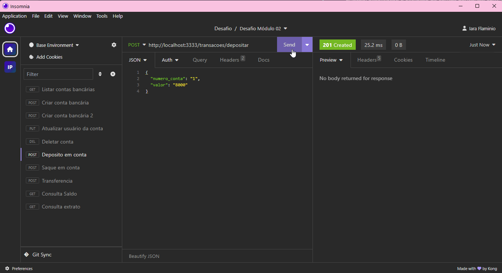
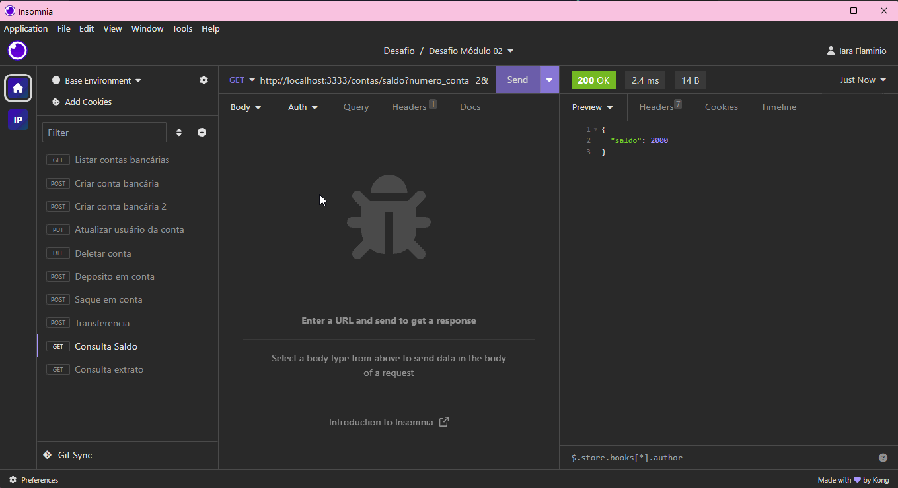
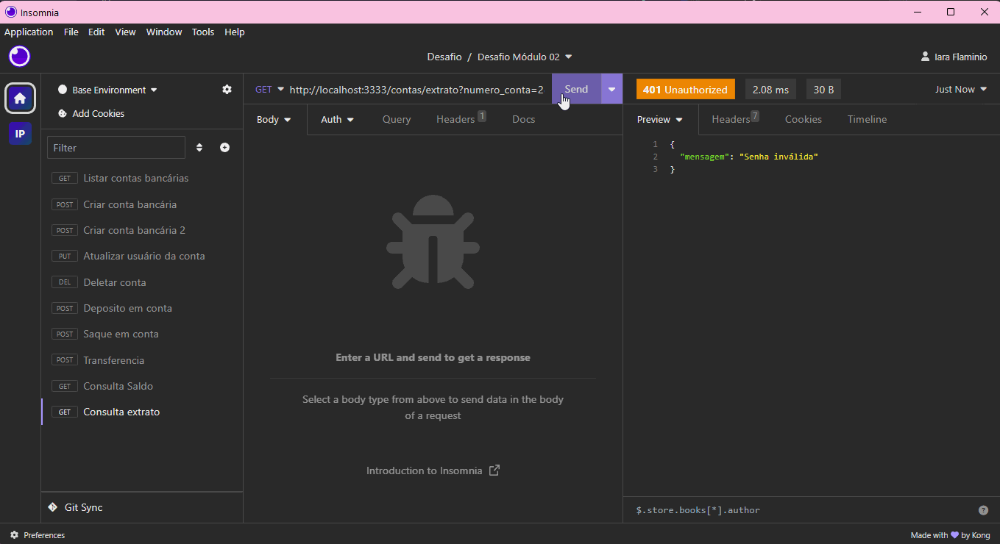
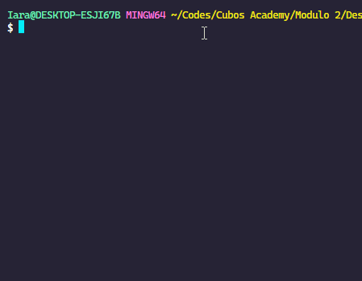

## Desafio Módulo 02 - Desenvolvimento de Softwareback-end

<h1 align="center">
  Projeto API Banco
</h1>

 <a href="#-sobre-o-projeto">Sobre</a> •
 <a href="#-funcionalidades">Funcionalidades</a> •
 <a href="#-como-executar-o-projeto">Como executar</a> •
 <a href="#-tecnologias">Tecnologias</a> •

## 💻 Sobre o projeto

📄Este projeto consiste no desenvolvimento de uma API REST para simular um sistema de gerenciamento bancário básico, focando em funcionalidades relacionadas ao backend. A API oferece endpoints para criar e gerenciar contas bancárias, realizar transações como depósitos, saques e transferências, bem como consultar o saldo e extrato das contas.

A API foi desenvolvida utilizando a linguagem de programação JavaScript e o ambiente de execução Node.js. Para o armazenamento dos dados, a API utiliza um banco de dados simulado em memória, onde as informações das contas, transações de depósitos, saques e transferências são armazenadas.

O projeto adota boas práticas de desenvolvimento, como a separação de responsabilidades em diferentes módulos, o uso de middlewares para validações, autenticação e autorização, e o padrão de arquitetura REST para a definição dos endpoints.

---

## ⚙️ Funcionalidades

### - Criação, atualização e exclusão de contas bancárias, com validações de dados como CPF e email

### - Realização de transações, incluindo depósitos, saques e transferências, com verificação de saldos e validações de senhas

### - Consulta de saldo e extrato das contas, com autenticação por senha

### - Validações de autenticação e autorização para transações sensíveis

---

## 🗂️ Como executar o projeto

### Pré-requisitos

Você vai precisar ter instalado em sua máquina as seguintes ferramentas:

- Git
- Node.js
- VSCode ou outro editor

Para trabalhar com o projeto você deverá seguir os seguintes passos:

- Clone este repositório
- Instale as dependências
- Execute a aplicação em modo de desenvolvimento
- O servidor inciará na porta:3333

---

## Tecnologias Utilizadas

- Node.js
- JavaScript
- Express
- Banco de dados Simulado em memória

- Teste de API:  Insomnia

---
